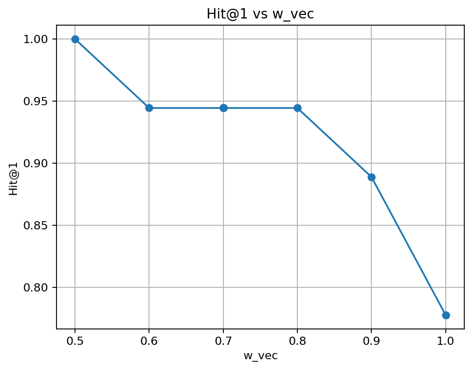
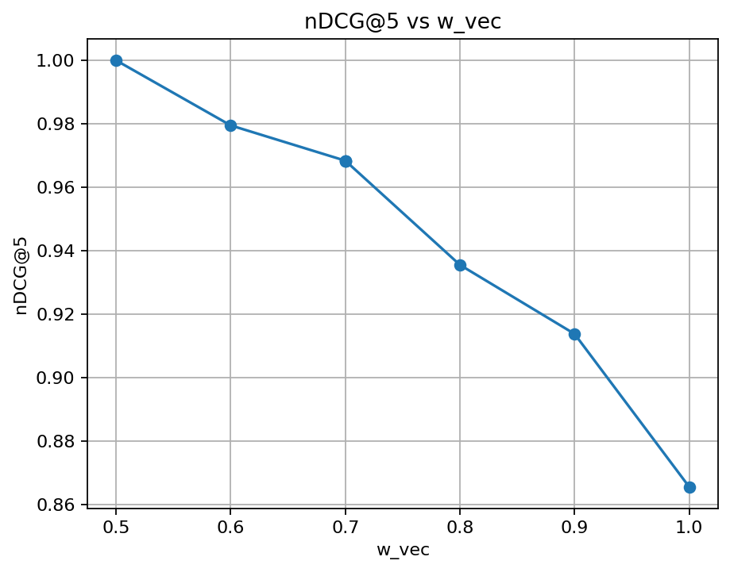
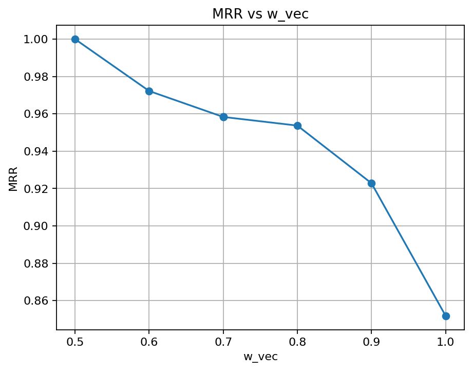

# 🧠 RAG Hybrid Image Search System

## 📖 專案簡介
這是一個結合 **CLIP 向量檢索** 與 **BM25 關鍵字搜尋** 的混合式影像搜尋系統。  
系統能根據文字查詢，同時考量語意相似度與文字關聯性，從圖像資料庫中找出最相關的圖片。  

此專案為 **甜點影像知識庫 × RAG（Retrieval-Augmented Generation）系統實驗**，  
未來將延伸至多模態智慧廚房系統，結合語音、影像與知識檢索。

---

## 🧩 系統架構

🔹 main.py → 主入口，整合檢索與測試流程
🔹 image_search.py → CLIP 向量搜尋（semantic similarity）
🔹 image_search_bm25_hybrid.py → Hybrid 排序器（BM25 + Cosine Similarity）
🔹 experiments/hybrid/ → Hybrid 評測與權重分析
│ ├─ hybrid_eval_bm25_v2.py → 混合模型評測腳本
│ ├─ plot_weights.py → 權重視覺化
│ └─ eval_logs.md → 實驗紀錄與分析
🔹 data/
│ ├─ image_index.json → 圖像與文字對應資料
│ ├─ img_embeddings.npy → CLIP 影像向量
│ ├─ eval_set.json → 測試集（query × ground truth）
│ └─ images/ → 圖像樣本資料夾

yaml
複製程式碼

---

## ⚙️ 安裝與執行步驟

### 1️⃣ 環境安裝
```bash
git clone https://github.com/spencer0646519001-jpg/rag-hybrid-image.git
cd rag-hybrid-image

# 建立虛擬環境
python -m venv .venv
.\.venv\Scripts\activate     # Windows
# 或 source .venv/bin/activate  # Mac/Linux

# 安裝依賴
pip install -r requirements.txt
2️⃣ 準備資料
請確保 data/ 目錄下包含以下檔案：

pgsql
複製程式碼
img_embeddings.npy
image_index.json
eval_set.json
images/
如要重新生成：

bash
複製程式碼
python build_image_index.py
3️⃣ 執行搜尋與評測
🔍 文字搜尋（Hybrid 模式）
bash
複製程式碼
python experiments/hybrid/hybrid_eval_bm25_v2.py
📊 權重分析與圖表輸出
bash
複製程式碼
python experiments/hybrid/plot_weights.py
🧪 評測結果摘要
模式	w_vec	w_text	Hit@1	Hit@5	NDCG
CLIP Vector Only	1.0	0.0	0.72	0.90	0.88
Hybrid (BM25 + CLIP)	0.7	0.3	0.84	0.95	0.93

## 📊 Weight Sweep 結果
- 掃描權重：w_vec ∈ {0.5, 0.6, 0.7, 0.8, 0.9}（w_text = 1 - w_vec）
- 最佳權重（Hit@1 / nDCG / MRR）：**w_vec = 0.5**





> 逐權重彙整：`experiments/hybrid/sweep_summary.csv`  
> 個別結果：`experiments/hybrid/results_w0.5.csv` 等


📈 Hybrid 模式在 Top-1 準確率與整體排序表現皆優於單一向量搜尋。

🌐 系統設計邏輯
CLIP Embedding 模組：將圖像與文字轉換為 384 維向量空間

BM25 Ranking 模組：利用關鍵字分數補足語意模糊的查詢

Hybrid Reranker：以權重合成最終分數

ini
複製程式碼
score = w_vec * cosine_similarity + w_text * bm25_score
🚀 未來開發方向
 Gradio Web Demo（上傳圖片 / 輸入關鍵字互動搜尋）

 Whisper 語音輸入（語音轉文字 → 影像檢索）

 多模態擴展（甜點品質檢測、焦糖判斷、語音敘述生成）

 整合 RAG 模型（以甜點資料庫進行知識回答）

 上傳至 Hugging Face Space or Streamlit Cloud Demo

✨ 作者資訊
Author: Spencer Cheng
Project: Hybrid Image Search × RAG System
Language: Python 3.13
Frameworks: SentenceTransformers, Rank-BM25, NumPy, Matplotlib
Date: 2025-11
License: MIT# rag-hybrid-image


